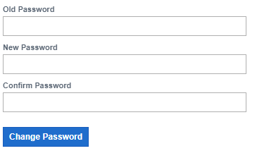

# Change My Password
A password is your personal key to a platform. Passwords are essential because they defend against unauthorized access to your platform and user’s data. Your password should be unique and should not be the same as your Login ID. Each user should have a good password that is easy to remember but hard for someone else to guess. You should treat it as confidential information. Change your password immediately if you suspect that it has been compromised.  
       
    <table border="1">
        <tr>
            <th>Name of Field</th>
            <th>Description</th>
        </tr>
        <tr>
            <td>Old Password</td>
            <td>Fill in your old password</td>
        </tr>
        <tr>
            <td>New Password</td>
            <td>Add your new password</td>
        </tr>
        <tr>
            <td>Confirm Password</td>
            <td>Add your new password again to confirm it</td>
        </tr>
    </table>