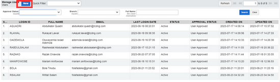
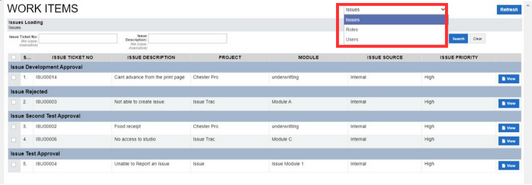
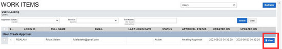
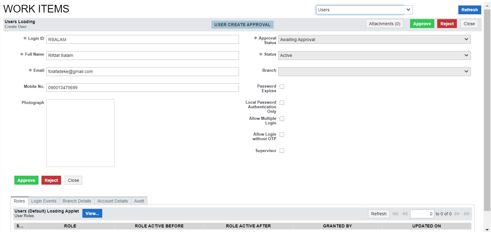

# Creating a new user

A user must be added to the system before being given privileges and access to the system. This section highlights the step-by-step process involved in creating a user and also describes what each field means.
 

<ol>
  <li><b>Click the New button:</b> 
      This is the first step in creating a new user. The New button is located at the top-left part of the user page. This button opens a blank form that contains all the information needed for the user.
       
      </li>
    <li><b>Fill the new User form: </b> 
      Once the New button is clicked a new form comes up. This form contains some mandatory fields that cannot be blank and also some other fields that are not mandatory and can be blank because they are optional.
        >>Note: Any field with the red asterisk * is a mandatory field. And this asterisk means that the field is required to be filled before the form can be saved. 
        This form contains fields for the collection of information from the user that is being created, these fields are:
         
        <table>
            <tr>
                <th>Field</th>
                <th>Description</th>
            </tr>
            <tr>
                <td>Login ID</td>
                <td>This is a special identifier that the system uses to specifically identify and authenticate a user upon login. This is usually a code or username that has been given to the user.</td>
            </tr>
            <tr>
                <td>Full Name</td>
                <td>The user's full name, which includes the first and last names. It is utilized within the system for personalization and identification.</td>
            </tr>
            <tr>
                <td>Email</td>
                <td>This is the user’s email address. It facilitates communication and is necessary for notifications.</td>
            </tr>
            <tr>
                <td>Mobile number</td>
                <td>This is the field where the user's mobile device's contact number is entered. It offers an alternate method of communication and can be used to verify information or send notifications.</td>
            </tr>
            <tr>
                <td>Photograph</td>
                <td>A user's visual representation of the user as an image or picture. It can aid in system customization and user recognition.</td>
            </tr>
            <tr>
                <td>Approval status</td>
                <td>This is a read-only field that cannot be edited by the user. This field tells whether the user is a new user or an existing user. This status may be used to regulate system operation or access rights.</td>
            </tr>
            <tr>
                <td>Status</td>
                <td>This is a drop-down list indicating the status of the user at that particular time, defining the current state of the user account. A user can be Active, Inactive, or Dormant.</td>
            </tr>
            <tr>
                <td>Branch</td>
                <td>This is the branch where this particular user works. A branch is a separate location of the company that is separated from the main office. The particular branch or location associated with the user is especially important in bigger systems or businesses with numerous locations.</td>
            </tr>
            <tr>
                <td>Password expires</td>
                <td>This is a checkbox which, when checked, indicates that the user's password has a time limit. After a specific amount of time, users will be asked to change their passwords for security reasons. Check this box if the user's password is only valid for a certain amount of time.</td>
            </tr>
            <tr>
                <td>Allow Multiple Logins</td>
                <td>If checked, this feature enables users to sign in to their accounts simultaneously from several devices or systems. Check this option to enable the user to sign in from numerous systems.</td>
            </tr>
            <tr>
                <td>Supervisor</td>
                <td>Check the box if the user is a supervisor.</td>
            </tr>
        </table>
    </li>
    <li><b>Save your form:</b> 
        After all necessary fields in the form have been filled, the next step is to save the form. Before saving a new user, this form must be submitted for approval and must also be approved by the proper authority. 
        To submit this form for approval, click on the Submit for Approval button which is located both at the right-top and at the left-bottom of the form. 
         
    </li>
    <li><b>Approve or Reject a new User:</b>
        After clicking the Submit for Approval button, this form is submitted to workflow for approval. Workflow is also an application on the sidebar, on click of this workflow some applets come up below it one of which is labeled My Work Items. 
         
            Click My Work Items to view the list of pending workflow items. These items are being filtered using the drop-down located on the top-right of the form.
         
        The option to choose depends on what is needed or what is being worked on, and in this case, the User option should be selected to view the pending workflow items available for the user option. The grid with the pending workflow items for the user option comes up when the option is selected. Click the View button to view the items in the grid.  
         
        The user form that was submitted for approval comes up on click of the view button. The form that was submitted comes up with the provided information, an action must be performed to proceed, these actions are:
         
        <ul>
            •	<b>Approve:</b> This is the button to be clicked to officially accept the creation of the new user. Once clicked the      new user is saved in the user applet and the user also gains access to assigned privileges. 
            •	<b>Reject:</b> This is the button to be clicked to officially decline the creation of the new user.  
            •	<b>Close:</b> This button only closes this view and opens the grid. The information in this form is not affected or       altered when the form closes.  
        </ul>
    </li>
</ol> 
