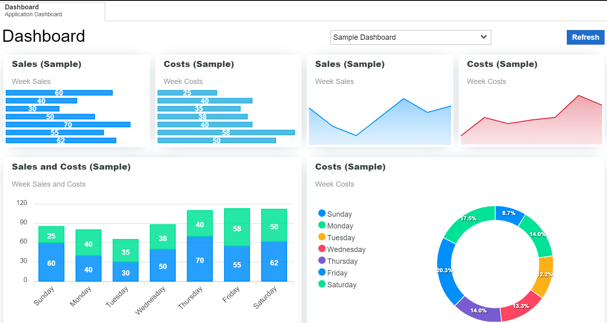

# Dashboard

A dashboard is a data visualization tool in the system that provides at-a-glance view of your organization’s key performance indicators. It serves as a visual representation for your organization to monitor progress and trends, and it changes with the system’s data.

Dashboards help you gain total visibility of all business activities instantly. The dashboard is the first thing displayed immediately after you log in to the system. For example, the Chief Financial Officer (CFO) dashboard is used by a company's CFO or Finance director to provide visual insights into relevant financial analytics of the organization. It is a tool that helps your organization to maintain a high-level overview of its financial health and overall performance.

