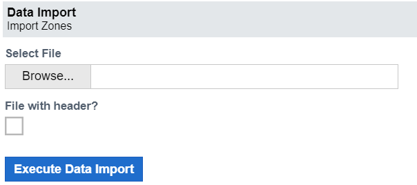

# Data Import

Data import allows you to upload data from outside sources and blend it with data already in the system.  
If your company has many systems, you can use data import to transfer data between them or import data from other apps. 

There are two systems, A and B, for example; you can import zones and branches from system A to system B. This can assist you in unifying and organizing your organization's data. Imported data can be used to improve reports and other business tasks.

The data import form looks like this:

Note that this form looks the same for both Branch and Zone import.

## Import Branches
This applet allows you to import branches from an external source and combine them with data already in the system. External branches can be uploaded straight from your PC.  

## Import Zones