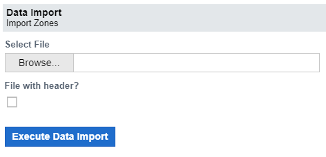
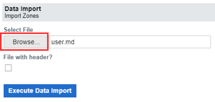
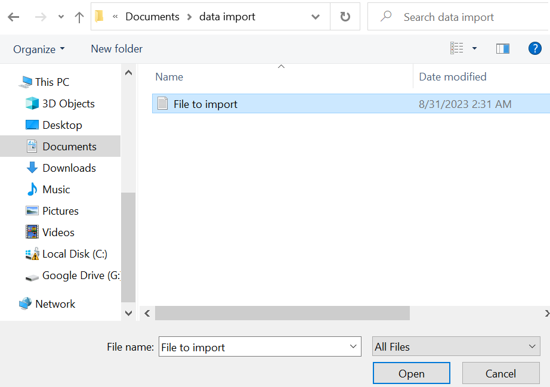
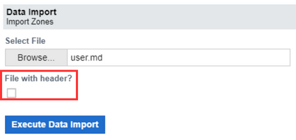
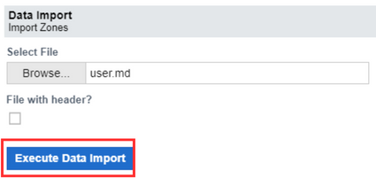
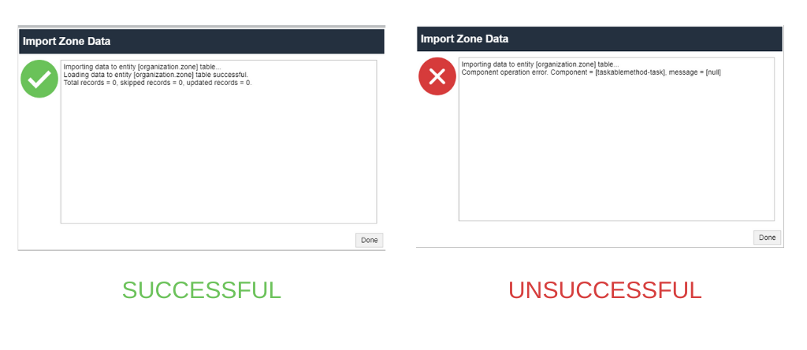

# Data Import

Data import allow user to upload data from outside sources and combine it with data already in the system. A company with many systems can use data import to transfer data between them or import data from other external sources.  
For example, There are two systems, A and B, you can import zones and branches from system A to system B. This can assist in unifying and organizing an organization's data. Imported data can be used to improve reports and other business tasks.
The data import form looks like this:
             
>Note that this form looks the same for Branch, Country and Zone import.

## What To Import

The file you import depends on the applet you select. Selecting any of these applets means that you want to import a file that relates to the selected applet. This section contains three applets and these applets are:
<ol>
    <li>Import Branches</li>
    <li>Import Country</li>
    <li>Import Zones</li>
</ol>
The file to be imported can be in a .pdf, .doc, .xls or .txt format.

## How to Import data

These are the step by step process involved in importing a file
<ol>
    <li><b>Click the prefered applet under the data import application on the sidebar menu option </b> 
    The applet to be selected depends on the task you want to execute. 
    </li>
    <li><b>Click the Browse button:</b> 
    This button opens your computer to select your preferred.
     
    </li>
    <li><b>Select Data:</b> 
        This is where you select the file/data you want to upload from your computer. Pick the file and click open or enter to select.
         
    </li>
    <li><b>File with Header?</b> 
        This checkbox lets you choose if your selected file should be with or without a header
         
    </li>
    <li><b>Execute Data Import:</b> 
        This button imports the selected file once clicked
         
    </li>
    <li><b>Import status:</b> 
        Once the execute data import button has been clicked, a notification message pops up. This message shows the status of the imported file, if the action was successful or not.  
        This notification also contains some details of the record and where the file was imported into. 
        A green mark on the notification message shows a successful import while the symbol "X" comes up in red to show that the import was not successful  
         
    </li>
</ol>

