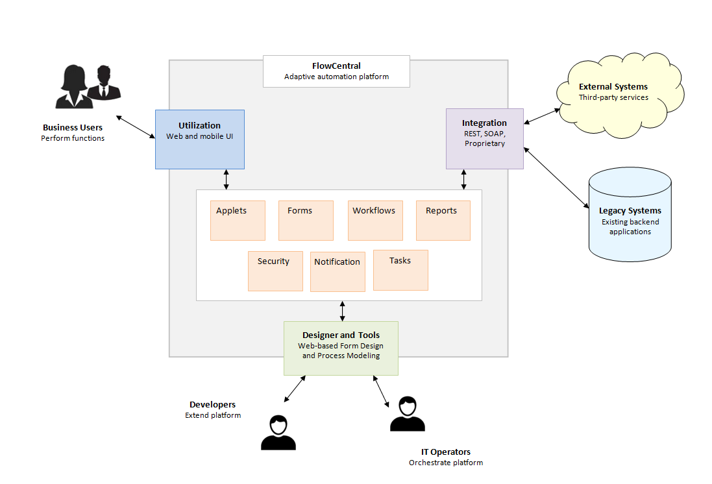

## Welcome to the FlowCentral Platform

FlowCentral is a low-code business process automation platform that makes it easy to build modern user-centric enterprise workflow applications fast. The system is designed to promote minimum inputs and maximum outputs which will help reduce manual efforts, streamline operations, simplify communication and increase the efficiency of your organization. 
 

The standard edition of the platform can be extended by developers and managed by the IT operators. Third-party services and existing backend applications can be integrated with the system to optimize performance and provide users with the best web or mobile experience.
Features of the system include Pre-built Functional Modules, Process Automation, a Low-code Platform, and Seamless Integration.
The pre-built enterprise application sub-systems are:
1. Organization
2. System
3. Notification
4. Dashboard
5. Data Import
6. Integration
7. Report
8. Security
9. Workflow
10. Workspace.

