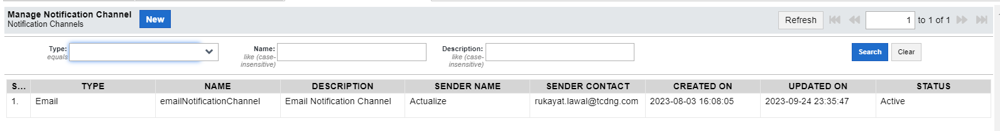
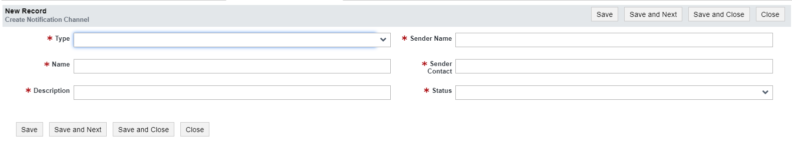
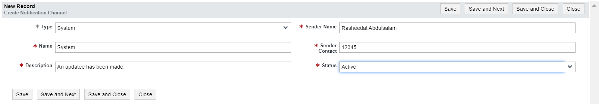
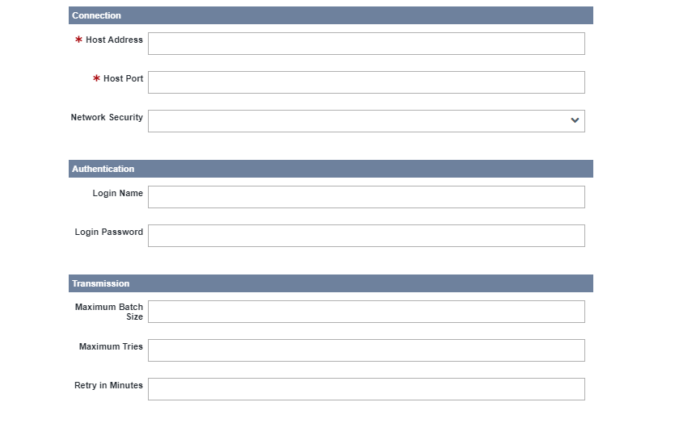

# Notification
Notifications are messages sent to alert a user when an event occurs.
Short Mail Service (SMS), email, and system notifications can be configured and sent when a new form is submitted, when existing form data is deleted or modified, or by triggering custom actions from reports. When a notification script is triggered, custom notifications are sent to a phone number, an email address, or a particular system. 

## Notification channel  
A Notification Channel is like a personalized pathway for messages in your system. It's a way to organize and manage the types of notifications you receive, tailoring them to fit your preferences and needs. It is like creating different folders for emails, with each folder serving a specific purpose.
<b>Why Do We Use Notification Channels?</b>
    <ul>
        <li>Customization: You get to decide how and when you want to be notified.</li>
        <li>Organization: Notifications are sorted into categories, making it easier to find and respond to the ones that matter most to you.
        </li>
        <li>Control: You have the power to adjust settings for each channel, ensuring that notifications align with your priorities.</li>
    </ul>
### Create a New Notification Channel
This section highlights the step-by-step process involved in creating a new notification channel and also describes what each field means.
<ol>
       <li>Click the New button: 
        This is the first step in creating a new notification channel. The New button is located at the top-left part of the page. This button opens a blank form that contains all the information needed for the notification channel.  
         
        </li>
        <li>Fill the new form: 
        Once the New button is clicked a new form comes up. This form contains some mandatory fields that cannot be blank and also some other fields that are not mandatory and can be blank because they are optional.
         
        This form contains fields for the collection of information needed for the new notification channel, these fields are:
        <ul>
            •	Notification Type: This is the type of channel through which you want the notification to be sent. There are three (3) types of notification channels available in this system, these three types of notification channels provide flexibility in how users and administrators are alerted about events or updates within the system:
            <ol>
                1.	System notification
                Alerts users within the system without a specific request from the user.
                System notifications alert users in the system without any particular request from the user. They can be configured by selecting when to send them, setting criteria to be met, and selecting users that the notifications will be sent to. 
                2.	Email notification
                Alerts users via email when specific events occur, such as adding a new user account or activity in a form.
                3.	SMS notification
                Configured and customized text messages are sent to administrators or users in response to specific events, like form submissions or modifications.
            </ol>
            •	Name: This is the name given to uniquely identify the channel.
            •	Description: This is the body of the notification, which is the message to be sent when this notification is triggered.
            •	Sender’s Name: This is the name of the user sending the notification out.
            •	Sender Contact: This is the contact of the user sending the notification out.
            •	Status: This is a drop-down list indicating the status of the user at that particular time, it defines the current state of the user account. A user can be Active, Inactive, or Dormant.
        </ul>
        </li>
        <li>Save your form:
        After all necessary fields in the form have been filled, the next step is to save the form. Before saving a new user, this form must be submitted for approval and must also be approved by the proper authority. 
         
        </li>
        To save this form click on any of the action buttons:
        <ul>
                o	Save: This button saves the form after all necessary fields have been filled.
                o	Save and Next: This button saves the form and opens a new form.
                o	Save and Close: This button saves and closes the form after saving.
                o	Close: This button closes the form page once clicked.
        </ul>

#### Child tab update
A child tab is a subsection that comes up after the main form has been saved. These tabs contain other information needed for the notification channel. This section provides audit details and setting options available for the notification channel

>>The system does not have direct access to the internet; therefore, a mail server is needed for this function. The Simple Mail Transfer Protocol (SMTP) Server is used for email transmission from the sender to the recipients. A correct settings configuration is required for the process to work. <a href="toc.md">See more details in our technical documentation</a>.

##### Channel Settings
When dealing with notification channels in a system, it is necessary to have various settings that can be adjusted to control the behavior of the notifications within each channel. Using the options in this child tab you can configure and customize each notification channel according to your preference.
<ol>
    <li>Edit Channel Setting child tab:
        •	Click the Edit button: once clicked, a form comes up with the setting options available in the system
         
    </li>
    <li>Fill the form: The channel setting form has been divided into three sections, Connection (Section 1), Authentication (Section     2), Transmission (Section 3):
        <table border="1">
            <tr>
                <th>Section</th>
                <th>Name of Field</th>
                <th>Description</th>
            </tr>
            <tr>
                <td>Connection</td>
                <td>Host Address</td>
                <td>The address of where the SMTP Server is</td>
            </tr>
            <tr>
                <td></td>
                <td>Host Port</td>
                <td>Port number that the system would be connected to on the SMTP Server</td>
            </tr>
            <tr>
                <td></td>
                <td>Network Security</td>
                <td>SSL/TLS or START/TLS</td>
            </tr>
            <tr>
                <td>Authentication</td>
                <td>Login Name</td>
                <td>Sender’s login name</td>
            </tr>
            <tr>
                <td></td>
                <td>Login Password</td>
                <td>Sender’s login password</td>
            </tr>
                <tr>
                <td>Transmission</td>
                <td>Maximum Batch Size</td>
                <td>Maximum number of notifications that can be sent at once</td>
            </tr>
            <tr>
                <td></td>
                <td>Maximum Tries</td>
                <td>Number of tries the system should attempt to send a particular notification</td>
            </tr>
            <tr>
                <td></td>
                <td>Retry in Minutes</td>
                <td>Number of minutes the system has to wait before it can send a failed email again</td>
            </tr>
        </table>
    </li>
    <li>3.	Save your form:
        After all necessary fields in the form have been filled, the next step is to save the form. 
        To save this form click on any of the action buttons:
                o	Save: This button saves the form after all necessary fields have been filled.
                o	Save and Next: This button saves the form and opens a new form.
                o	Save and Close: This button saves and closes the form after saving.
                o	Close: This button closes the form page once clicked.
    </li>
</ol>
##### Audit (Section B)
This is the audit section, this section is automatically filled with the details of the owner of the account used in creating or making changes to the module.
        

            

                 
            

        

This section is automatically filled by the system with the details of the account used in creating, inspecting or modifying this account. These details include:
         

<table>
    <tr>
        <th>Name of Field</th>
        <th>Description</th>
    </tr>
    <tr>
        <td>Created By</td>
        <td>This is the name of the person who created this account.</td>
    </tr>
    <tr>
        <td>Updated By</td>
        <td>This is the name of the last person that updated this account.</td>
    </tr>
    <tr>
        <td>Created On</td>
        <td>This is the date and time that this user’s account was created.</td>
    </tr>
    <tr>
        <td>Updated On</td>
        <td>This is the date and time that the last update was made on this user’s account.</td>
    </tr>
</table>

 
