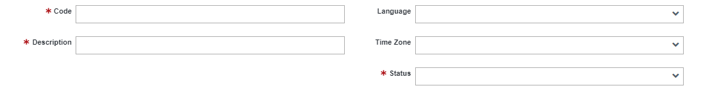
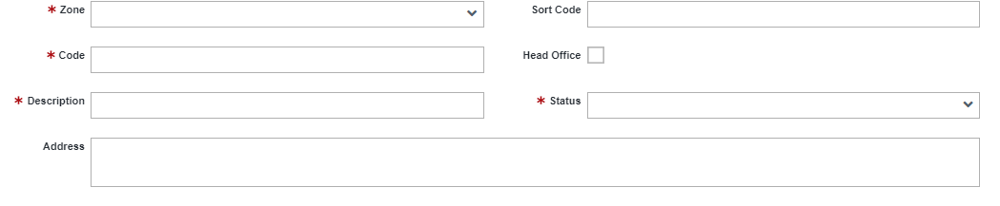
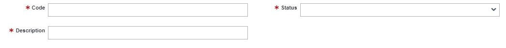
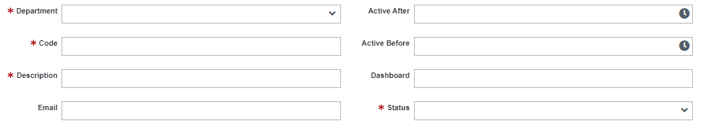

# Organization
Organization in the system is an application that reflects your company’s structure. It help organizations create an automated flow for all business activities and also specifies the business’s hierarchical structure. It assist an organization in categorizing who has access to what project.

An organization can seamlessly keep track of various zones, branches, and the departments within the organization. It assist employees in knowing who to report to and their roles in achieving the goals and objectives of the organization.

This application called Organization is made up of many applets. Applets are small computer programs that perform a specific task, for example the applets associated with an organization are <a href="#zone">Zone</a>, <a href="#branch">Branch</a>, Department and Role, the individual task of these applets combined together is what makes an Organization.

### Zone

A zone is a location where your business can be found in different parts of the world. It enables you to add and manage records for various organizational zones. You can add a new zone using the Zone form.

<!---->
The zone form looks like this:

<table>
    <tr>
        <th>Name of Field</th>
        <th>Description</th>
        <th>Required</th>
    </tr>
    <tr>
        <td>Code</td>
        <td>A unique code that identifies a particular zone</td>
        <td>Yes</td>
    </tr>
    <tr>
        <td>Description</td>
        <td>Short information about the zone. This field is limited to just 65 characters</td>
        <td>Yes</td>
    </tr>
    <tr>
        <td>Language</td>
        <td>Drop-down list of all the languages in the world</td>
        <td>No</td>
    </tr>    
    <tr>
        <td>Time zone</td>
        <td>Drop-down list of all time zones</td>
        <td>No</td>
    </tr>    
    <tr>
        <td>Status</td>
        <td>Drop-down list to indicate if the zone is Inactive, Active or Dormant</td>
        <td>Yes</td>
    </tr>    
</table>

### Branch

An organization's branch is a location where operations are carried out or managed aside from the main office.The branch applet allows you to add and manage your company's branches in in various locations.

The branch form looks like this:

<table>
    <tr>
        <th>Name of Field</th>
        <th>Description</th>
        <th>Required</th>
    </tr>
    <tr>
        <td>Zone</td>
        <td>The zone where a branch is located</td>
        <td>Yes</td>
    </tr>
    <tr>
        <td>Code</td>
        <td>A unique code that identifies the branch internally</td>
        <td>Yes</td>
    </tr>
    <tr>
        <td>Description</td>
        <td>Short information about the branch</td>
        <td>Yes</td>
    </tr>
    <tr>
        <td>Address</td>
        <td>Where the branch is located</td>
        <td>No</td>
    </tr>    
    <tr>
        <td>Sort Code</td>
        <td>A unique code that identifies the branch externally</td>
        <td>No</td>
    </tr>
    <tr>
        <td>Head Office</td>
        <td>Check the box if the branch in the record is the Head Office branch</td>
        <td>No</td>
    </tr>
    <tr>
        <td>Status</td>
        <td>Drop-down list to indicate if the zone is Inactive, Active or Dormant</td>
        <td>Yes</td>
    </tr>    
</table>

### Department

Departments are divisions inside your organization. Each department has a distinct role. Departments are the backbone of an organization, and their purpose is to enhance the company and assist it in achieving its goals and objectives. Personnel, production, administrative, and sales departments are a few examples.

The department form looks like this:

<table>
    <tr>
        <th>Name of Field</th>
        <th>Description</th>
        <th>Required</th>
    </tr>
    <tr>
        <td>Code</td>
        <td>A unique code that identifies a department.</td>
        <td>Yes</td>
    </tr>
    <tr>
        <td>Description</td>
        <td>Short information about the department. Like the name.</td>
        <td>Yes</td>
    </tr>    <tr>
        <td>Status</td>
        <td>Drop-down list to indicate if the zone is Inactive, Active or Dormant</td>
        <td>Yes</td>
    </tr>
</table>

### Role

A role is a position in an organization held by a user (team member or employee). Creating roles in the system allows you to grant users the appropriate level of access based on their position in the organization's structure. Having defined roles in your organization would help to answer the question of “who” does “what.” 
As your organization expands, it can be hard to manually keep track of the various roles performed by your employees. This solution saves you time and increases the administrative efficiency of the organization, you can assign privileges to roles and assign roles to users.

The role form looks like this:

<table>
    <tr>
        <th>Name of Field</th>
        <th>Description</th>
        <th>Required</th>
    </tr>
    <tr>
        <td>Zone</td>
        <td>The zone where a branch is located</td>
        <td>Yes</td>
    </tr>
    <tr>
        <td>Code</td>
        <td>A unique code that identifies the branch internally</td>
        <td>Yes</td>
    </tr>
    <tr>
        <td>Description</td>
        <td>Short information about the branch</td>
        <td>Yes</td>
    </tr>
    <tr>
        <td>Address</td>
        <td>Where the branch is located</td>
        <td>No</td>
    </tr>    
    <tr>
        <td>Sort Code</td>
        <td>A unique code that identifies the branch externally</td>
        <td>No</td>
    </tr>
    <tr>
        <td>Head Office</td>
        <td>Check the box if the branch in the record is the Head Office branch</td>
        <td>No</td>
    </tr>
    <tr>
        <td>Status</td>
        <td>Drop-down list to indicate if the zone is Inactive, Active or Dormant</td>
        <td>Yes</td>
    </tr>    
</table>

##### Assigning privileges to roles
Role Privileges must be assigned in the system after an administrator/operator creates a role. This is to ensure that users with a specific role have access to the correct features when they log in to the system, as the system only displays and grants access to the privileges assigned to a specific role.
To display the Role Privileges form, click on the role created, the Edit button allows you to add privileges to the role.
<!--The form looks like this:

<table>
    <tr>
        <th>Name of Field</th>
        <th>Description</th>
        <th>Required</th>
    </tr>-->

