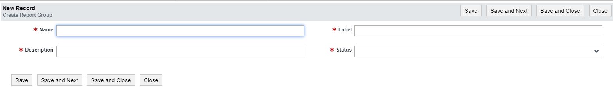
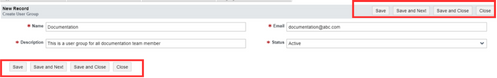

# Report
A business report is a document that presents information, analysis, and insights related to a specific aspect of the system. It typically includes the summary of the information contained in an application or applet which is often structured in a formal way.
The purpose of this report is to provide relevant information that aids decision-making within the organization. They can be used for internal reviews, to communicate with stakeholders, or for strategic planning.  
The system provides fully customizable reports in applications with flexible options such as different layouts and formats, scheduling the generation of a report, and distributing reports to the intended users, including non-FlowCentral users, through e-mail.  
Manual report processing usually has low accuracy, poor security, and a heavy workload. The report application eases this process such that the organization can automatically generate a report from data quickly, accurately, and without stress.
## Generate Report

This is the applet where reports are generated and printed.

### How to generate a report
<ol>
    <li><b>Hover and Click:</b> The list of available reports is displayed in this grid, and to open a report of your choice, Hover over the name of the report and then click it.
         
    </li>
    <li><b>The Report Runner:</b> Once the report has been clicked, a report runner screen pops up, this contains different options for you to select so as to configure how the report to be generated will be displayed.
         
        Customize your Report with these display options:
        <ol>
            <li><b>Print Column Names:</b> This lets you decide whether to Print the column names with the report or not. This option will be checked by default which means the column name will be displayed in the report, but can be unchecked if not desired.
            </li>
            <li><b>Landscape:</b> If checked, the report will be printed in landscape and not portrait.</li>
            <li><b>Download:</b> If checked this checkbox allows you to download the report instead of just viewing it.</li>
            <li><b>Shade Odd Rows:</b> If checked, the background of the cells in the odd Rows will be shaded</li>
            <li><b>Underline Rows:</b> If checked, this puts a line under each row in the report being generated</li>
            <li><b>Document Format:</b> This is the specific structure used to organize and present the information within the report document. It determines how the data, text, images, and other elements are formatted, stored, and displayed. There are three (3) formats available in the system:
                <ol>
            <b> •	Portable Document Format (PDF):</b> Ideal for printing the report while maintaining the original formatting across different devices and operating systems. 
            <b> •	Excel:</b> Displays or prints the report in a spreadsheet format. 
            <b> •	Comma Separated Values (CSV):</b> Organizes the report in a simple text format, and can be easily opened in spreadsheet applications like Excel for data exchange and analysis. 
                </ol>
            </li>
            <li><b>Action Buttons:</b> After the required checkbox has been checked and a format has been selected, there are two (2) ways to proceed:
                <ol>
             <b> •	Run Report button:</b> This button displays or prints the report according to the selected checkbox 
             <b> •	Close button:</b> This button closes the report runner screen and returns all checkbox back to default 
                </ol>
            </li>
        </ol>
    </li>
</ol>

## Report Group

A Report Group is a collection of related reports grouped for organizational or categorization purposes. These groups are organized based on similarities in content, purpose, or the audience they serve.

### Create a New Report Group
This section highlights the step-by-step process involved in creating a new report group and also describes what each field means.
<ol>
    <li><b>Click the New button:</b> 
    This is the first step in creating a new report group. The New button is located at the top-left part of the page. This button opens a blank form that contains the main information needed for the report group.  
    </li>
    <li><b>Fill the new form:</b> 
    Once the New button is clicked a new form comes up, fill all necessary fields. 
>>Any field with the red asterisk * is a mandatory field. And this asterisk means that the field is required to be filled before the form can be saved
         
        <ul>
            <b> •	Name:</b> This is the name given to uniquely identify the report group. 
            <b> •	Description:</b> This is an information about the report group. 
            <b> •	Label:</b> This is the email associated with the user group. 
            <b> •	Status:</b> This is a drop-down list indicating the status of the user at that particular time, it defines the current state of the user account. A user can be Active, Inactive, or Dormant. 
        </ul>
    </li>
    <li><b>Save your form:</b>
        After all necessary fields in the form have been filled, the next step is to save the form. Before saving a new user, this form must be submitted for approval and must also be approved by the proper authority.    
         
        To save this form click on any of the action buttons:
        <ul>
        <b>  o	Save:</b> This button saves the form after all necessary fields have been filled. 
        <b>  o	Save and Next:</b> This button saves the form and opens a new form. 
        <b>  o	Save and Close:</b> This button saves and closes the form after saving. 
        <b>  o	Close:</b> This button closes the form page once clicked. 
        </ul>
    </li>
</ol>