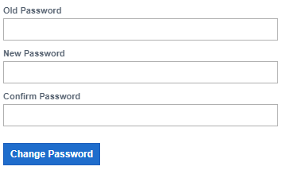

# SECURITY
We constantly strive to maintain the highest security standards in order to protect your sensitive information and deliver a secure digital experience. The system allows you to protect your applications from security threats and risks such as insecure data and unauthorized access. You can make app-specific configurations such as changing your password, adding new Users/User Groups, and managing existing users.

## Change My Password

A password is your personal key to a platform. Passwords are essential because they defend against unauthorized access to your platform and user’s data. Your password should be unique and should not be the same as your Login ID. Each user should have a good password that is easy to remember but hard for someone else to guess. You should also treat it as confidential information, and change your password immediately if you suspect that it has been compromised. 
The form looks like this:

<table>
    <tr>
        <th>Name of Field</th>
        <th>Description</th>
        <th>Required</th>
    </tr>
    <tr>
        <td>Old Password</td>
        <td>Fill in your old password</td>
        <td>Yes</td>
    </tr>
    <tr>
        <td>New Password</td>
        <td>Add your new password</td>
        <td>Yes</td>
    </tr>
    <tr>
        <td>Confirm Password</td>
        <td>Add your new password again to confirm it</td>
        <td>Yes</td>
    </tr>
</table>

