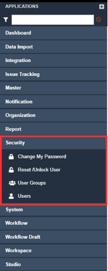

# Security
The system maintains a high security standard which help protect your sensitive information while also providing a secure digital experience. This section allows you to protect your applications from security threats and risks such as insecure data and unauthorized access. You can make app-specific configurations such as:  
<ul>
    •	changing your password 
    •	adding new users 
    •	adding new user groups 
    •	managing existing users 
</ul>
The security application can be seen on the sidebar located on the left-hand side of the system, this application contains four applets that help in making some specific changes and configurations.  
         
        