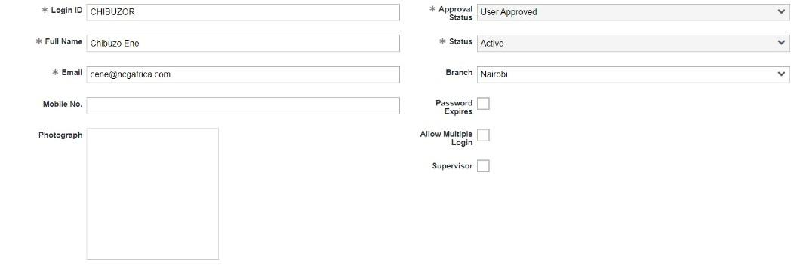
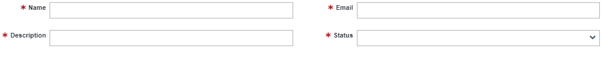

# SECURITY
We constantly strive to maintain the highest security standards in order to protect your sensitive information and deliver a secure digital experience. The system allows you to protect your applications from security threats and risks such as insecure data and unauthorized access. You can make app-specific configurations such as changing your password, adding new Users/User Groups, and managing existing users.

## User

A user is an individual who has access to the system depending on the roles that the administrator has given them. With the platform, you may manage a big number of users. A Login ID and Password are required to access a user's account. It enables the gathering of user data and the role-based integration of users into the organization.

Individuals who are part of the organization, such as administrators, developers, and any other staff who is directly or indirectly associated to the system, are considered users. The organization's applications are completely accessible to the administrator. Users will be granted access to the system in accordance with their roles within the company; this limits unlawful access to the applications and grants them only limited functionality within the system. 
The form looks like this: 

<table>
    <tr>
        <th>Name of Field</th>
        <th>Description</th>
        <th>Required</th>
    </tr>
    <tr>
        <td>Login ID</td>
        <td>System Login ID is what most people know as a Username</td>
        <td>Yes</td>
    </tr>
    <tr>
        <td>Full Name</td>
        <td>User's full name</td>
        <td>Yes</td>
    </tr>
    <tr>
        <td>Email</td>
        <td>User's email address</td>
        <td>Yes</td>
    </tr>
     <tr>
        <td>Mobile No.</td>
        <td>User's Mobile number</td>
        <td>No</td>
    </tr>
    <tr>
        <td>Photograph</td>
        <td>This is the photograph that appear on the user's account</td>
        <td>No</td>
    </tr>
    <tr>
        <td>Approval Status</td>
        <td>This is a dropdown of options to know if the particular user has been approved or not</td>
        <td>Yes</td>
    </tr>
     <tr>
        <td>Status</td>
         <td>This is a dropdown list indicating if the user is <b>Active, Inactive</b> or <b>Dormant</b></td>
        <td>Yes</td>
    </tr>
    <tr>
        <td>Branch</td>
        <td>This is the branch where the user is stationed</td>
        <td>No</td>
    </tr>
    <tr>
        <td>Password Expires</td>
        <td>This checkbox is checked only if the user's password is set for a particular period</td>
        <td>No</td>
    </tr>
     <tr>
        <td>Allow Multiple Login</td>
        <td>When checked, this checkbox allows the user to access the same account from various devices.</td>
        <td>No</td>
    </tr>
    <tr>
        <td>Supervisor</td>
        <td>This box should be checked if the user is a supervisor</td>
        <td>No</td>
    </tr>
</table>

After successfully adding a new user, three different child tabs appear below the parent form 

>Note: A child tab only come up when the parent form has been saved successfully, which means they depend on the information in the parent form (which is the main form).

#### User Roles
Adding a new user is not all that should be done before the user start using the system, before a user can do any work after being added to the system, you must assign them a role and grant them access to particular applications. Also note tht a user can be given more than one role. 
The edit button in the **Role** child tab directs you to a different form where you can manage privileges based on your preferences.
An illustration of a case scenario is adding Shawn, a developer, as a user to the system.Shawn cannot add new applications or manage existing ones unless the system’s administrator assigns a developer role to Shawn. The developer role already has specific privileges attached to it so Shawn will not have access to the part of the system built for the developers.
#### Branch Detail

#### Account Detail

## User Group

A user group is a group of users that perform similar tasks in the organization. User groups help reduce the stress of assigning individual privileges to users with similar access requirements. Users in a particular group can access the records shared to the group and perform any required operations on the records. Users can belong to multiple groups. For example, by creating a group with all the employees in a specific department, administrators can define privileges for the whole department in one place. 

The form looks like this:

## Change My Password

A password is your personal key to a platform. Passwords are essential because they defend against unauthorized access to your platform and user’s data. Your password should be unique and should not be the same as your Login ID. Each user should have a good password that is easy to remember but hard for someone else to guess. You should also treat it as confidential information, and change your password immediately if you suspect that it has been compromised.  
The form looks like this: 

<table>
    <tr>
        <th>Name of Field</th>
        <th>Description</th>
        <th>Required</th>
    </tr>
    <tr>
        <td>Old Password</td>
        <td>Fill in your old password</td>
        <td>Yes</td>
    </tr>
    <tr>
        <td>New Password</td>
        <td>Add your new password</td>
        <td>Yes</td>
    </tr>
    <tr>
        <td>Confirm Password</td>
        <td>Add your new password again to confirm it</td>
        <td>Yes</td>
    </tr>
    <tr>
        <td>Change Password</td>
        <td>When this button is clicked, the password will be changed to the new password entered by the user.</td>
        <td>Yes</td>
    </tr>
</table>

