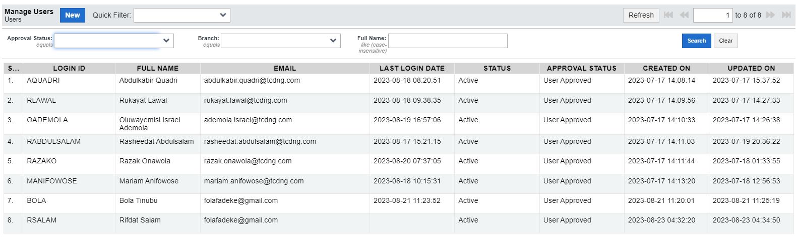

# User

A user is an individual who has access to the system. This access is based on roles assigned by the administrator. Users can log in to their accounts with an authorized login ID and password.  
This section allows you to collect a user’s data and fit users into the organization based on their roles.
On click of this applet, a grid comes up and this grid consists of a list of users with access to the system  
 
On this grid, a row contains a particular user's information while the columns are the categories where each information belongs. There are nine columns in the grid and the first cell of each column is the label describing what each category is:
 

>Note that this form looks the same for both Branch and Zone import.    
    
<table>
    <tr>
        <th>Name of Field</th>
        <th>Description</th>
    </tr>
    <tr>
        <td>Login ID</td>
        <td>System Login ID, which most people know as a Username</td>
    </tr>
    <tr>
        <td>Full Name</td>
        <td>User's full name</td>
    </tr>
    <tr>
        <td>Email</td>
        <td>User's email address</td>
    </tr>
     <tr>
        <td>Last Login Date</td>
        <td>The timestamp of when the user made a successful login</td>
    </tr>
    <tr>
        <td>Status</td>
        <td>A drop-down list indicating if the user is Inactive, Active, or Dormant</td>
    </tr>
    <tr>
        <td>Approval Status</td>
        <td>Status of approval</td>
    </tr>
     <tr>
        <td>Created On</td>
         <td>The timestamp of when this user account was created</td>
    </tr>
    <tr>
        <td>Updated On</td>
        <td>The timestamp of when this user account was last updated</td>
    </tr>
</table>

 

	
