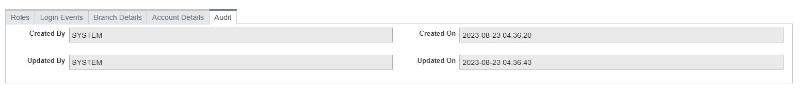

# Child tab update
 
A child tab is a subsection that comes up after the main form has been saved. These tabs contain other information needed for and from the user. This section provides information like:
<ul>
    •	Roles assigned to the user 
    •	The login events of the user 
    •	The branch the user is located 
    •	User’s account details  
    •	Audit of the account 
</ul>
 

### Role Child Tab 
After adding a new user account to the system, you need to assign a role(s) to give the user access to specific applications in the system before they can perform any task. 
A Role is a duty assigned to the user. The user is expected to carry out the duties and responsibilities relating to the assigned role. Each role comes with different privileges, which means that you will only have privileges to the part of the system that is associated with your role, and this also means that what a developer will have access to is different from what a business analyst will have access to.  
To assign a role or make changes to the assigned role:
<ol>
    1.	Edit Role child tab: 
            •	Click the Edit button: once clicked this button will direct you to the role form where you will select the role of the user
             
            On click of this edit button a message pops up on the screen asking whether to perform the operation in edit mode or in view mode. There are three options available to be selected:
             
            <ul>
                •	Yes, open editable draft: Clicking this means you want to edit the form and it should proceed to create a             workflow draft. If you want to edit the role form this option must be chosen
                •	No, open in view mode: Clicking this option means that you want the system to open in view mode. Clicking this       will only view the roles and the form cannot be edited
                •	Cancel: This option closes this message and no further action is performed
            </ul>
    2.	Assign Role:  
        This page comes up on click of the edit button and it contains a list of available roles. This is where you will assign a role to the user created. The box on the right-hand side of the page labelled "Available roles" contains the roles available in the system, and the box on the left-hand side of the page labelled "Assigned roles" is where the roles selected will be moved to. 
             
        The arrows in the middle of the two boxes are for moving the roles from the available box to the assigned box and vice versa.
             
    3.	Save assigned role: 
        After you have assigned one or more roles to the user the next step is to save the page. This step must not be skipped because the role will not be assigned to the user if the page is not saved. There are two buttons available to perform this action:
             
        <ul>
            •	Save button: This button only saves the page. 
            •	Save and close button: This button saves the page and also close the page. Clicking this button saves and redirects       you to the main form. 
            •	Close button: This button close this page 
        </ul>
</ol>

## LOGIN EVENT
Login Events is another child tab in the user applet, it contains records or logs that capture the specifics of user login activities within the system. 
 
<table>
    <tr>
        <th>Name of Field</th>
        <th>Description</th>
    </tr>
    <tr>
        <td>Remote Address</td>
        <td>This is the IP address of the device used by the user to connect to this system over the internet or a larger network.</td>
    </tr>
    <tr>
        <td>Remote Host</td>
        <td>This is the user's personal computer that is in another place and is connected to the Internet for file transfers and to remotely control operations in this system.</td>
    </tr>
    <tr>
        <td>Created On</td>
        <td>This is the date and time that the user’s account was created.</td>
    </tr>
    <tr>
        <td>Updated On</td>
        <td>This is the date and time that the last update was made on this user’s account</td>
    </tr>
    <tr>
        <td>Event Type</td>
        <td>This indicates the type of event that occurred during the process</td>
    </tr>
</table>

 

## Branch Details
This child tab contains the information of the branch where this user is assigned or works. A branch is a separate location of the company that is separated from the main office. These details include: 
         

<table>
    <tr>
        <th>Name of Field</th>
        <th>Description</th>
    </tr>
    <tr>
        <td>Code</td>
        <td>This is an internationally recognized code designated to each branch. This code can be letters, numbers, or alphanumeric.</td>
    </tr>
    <tr>
        <td>Branch</td>
        <td>This is the name of the branch.</td>
    <tr>
        <td>Language</td>
        <td>This is a drop-down list of languages spoken in the named branch.</td>
    </tr>
    <tr>
        <td>Time Zone</td>
        <td>This is the time zone in which this branch operates</td>
    <tr>
        <td>Zone Code</td>
        <td>This is an internationally recognized code designated to each Zone. This code can be letters, numbers, or alphanumeric.</td>
    </tr>
    <tr>
        <td>Zone</td>
        <td>This is the name of the region where this particular branch is located within.</td>
    </tr>
</table>

 

## Account Details
This child tab contains the details of some activities related to this particular account.
         
These activities are:
<table>
    <tr>
        <th>Name of Field</th>
        <th>Description</th>
    </tr>
    <tr>
        <td>Last Login Date</td>
        <td>This is the last date and time this user successfully logged into the system. This field has two separate fields, the first one is for the date and the second one is for the time.</td>
    </tr>
    <tr>
        <td>Password Expires On</td>
        <td>This is the date this user’s password will expire. This comes up only when the checkbox labelled “Password” is checked (See Creating new user for more details).</td>
    </tr>
    <tr>
        <td>Account Locked</td>
        <td>This is a checkbox indicating if the account has been locked or not.</td>
    </tr>
    <tr>
        <td>Change password</td>
        <td>This is a checkbox indicating if the user should change the password or not.</td>
    </tr>
</table>

 

## Audit
This section is automatically filled by the system with the details of the account used in creating, inspecting or modifying this account. These details include:
         

<table>
    <tr>
        <th>Name of Field</th>
        <th>Description</th>
    </tr>
    <tr>
        <td>Created By</td>
        <td>This is the name of the person who created this account.</td>
    </tr>
    <tr>
        <td>Updated By</td>
        <td>This is the name of the last person that updated this account.</td>
    </tr>
    <tr>
        <td>Created On</td>
        <td>This is the date and time that this user’s account was created.</td>
    </tr>
    <tr>
        <td>Updated On</td>
        <td>This is the date and time that the last update was made on this user’s account.</td>
    </tr>
</table>

 
	
	
	