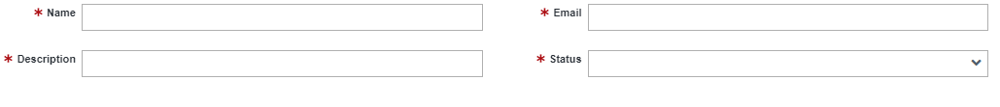

# User Group

A user group is a collection of users that perform similar tasks or share common characteristics in the organization. User groups make it easier to grant unique capabilities to individuals with similar access requirements, reducing the need for specifying permission for each user. Users in a particular group can access the shared records and perform any required operations on the records. 
Users can belong to multiple groups. For example, by creating a group with all the employees in a specific department, administrators can define privileges for the whole department in one place. 

## Create a new user group
This section highlights the step-by-step process involved in creating a new user group and also describes what each field means.
    <ol>
        <li>Click the New button: 
        This is the first step in creating a new user group. The New button is located at the top-left part of the page. This button opens a blank form that contains all the information needed for the user group.  
             
        </li>
        <li>Fill the new form: 
        Once the New button is clicked a new form comes up fill all necessary fields. 
         
        This form contains fields for the collection of information needed for the new notification channel, these fields are:
        <ul>
        •	Name: This is the name given to uniquely identify the user group. 
        •	Description: This is an information about the user group. 
        •	Email: This is the email associated with the user group. 
        •	Status: This is a drop-down list indicating the status of the user at that particular time, it defines the current state of the user account. A user can be Active, Inactive, or Dormant. 
        </ul>
        </li>
        <li>Save your form:
        After all necessary fields in the form have been filled, the next step is to save the form. Before saving a new form, this form must be submitted for approval and must also be approved by the proper authority.
         
        To save this form click on any of the action buttons:
            <ul>
                o	Save: This button saves the form after all necessary fields have been filled. 
                o	Save and Next: This button saves the form and opens a new form. 
                o	Save and Close: This button saves and closes the form after saving. 
                o	Close: This button closes the form page once clicked. 
            </ul>
        </li>
    </ol>
>>Any field with the red asterisk * is a mandatory field. And this asterisk means that the field is required to be filled before the form can be saved

