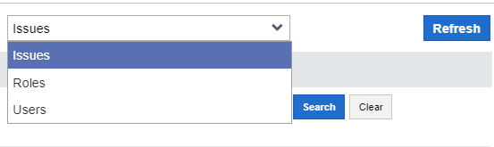
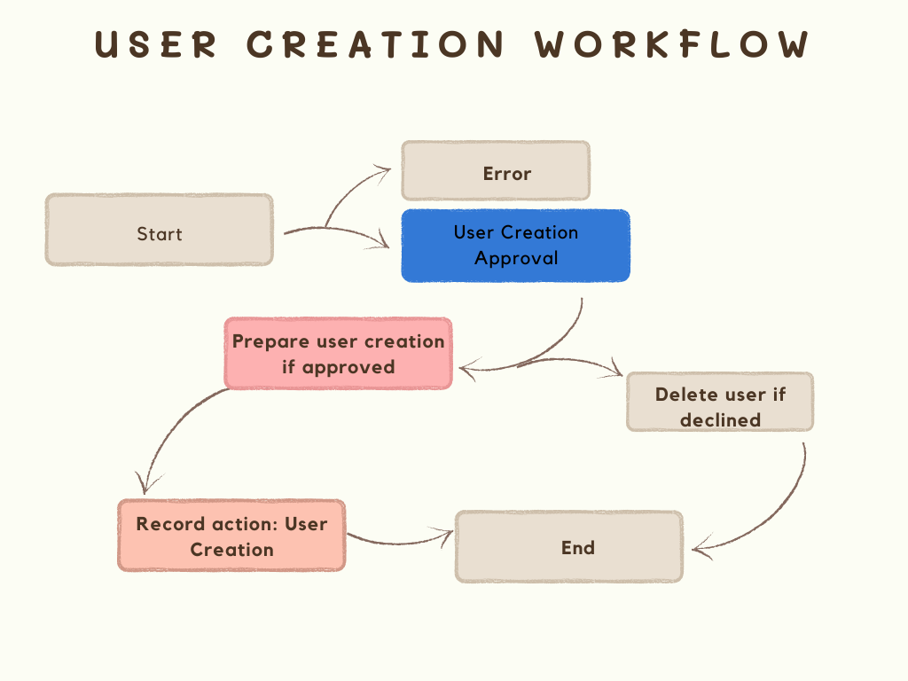

# Workflow
The workflow application allow organizations to automate processes in the system.  A workflow is the sequence of steps a process takes from start to finish. Apart from helping to reduce labor costs, the workflow automation application improves accuracy within a particular workflow, while keeping the record of these actions in its applets.  Human error can be significantly reduced due to the limited number of actions a user can take in implementing a workflow.  
To implement a workflow, you will need to use a trigger event that, once satisfied, causes a particular set of actions to be performed across your applications. Workflow automation can be applied to processes in various organizational departments such as sales, finance, human resources (HR), and information technology (IT). For example, you can create a workflow to streamline the user approval process. When a new user form is submitted for approval, it triggers a user approval workflow. 
    

    

         
    

    

 
## Workflow Item

Workflow item is an applet that houses the records of the actions performed in workflow. As a workflow is triggered, the information about where the item is coming from, the next step of action in the workflow process, the date, the user that forwarded the item, its priority on a scale of importance, error codes, and error messages are displayed by the workflow item. 
It basically captures information about a task, process, or action as it progresses through the workflowand each of these workflow items are associated with a particular workflow and serves as a container for data related to the execution of that workflow.

  

    

       
    

  

For ease of selection and to help users to selectively view and organize the workflow item, a filter have been provided on the upper-right side of the workflow page just beside the Refresh button. 
       
This filter helps to narrow down the items in the workflow item grid, displaying only the items under the selected workflow.

## Workflows
This is a record of all the workflows in the system. Each workflow is a series of related tasks executed at specific instances. All the workflows in the system have a record of details about the workflow and the steps involved. 
Let us take a look at one of the workflows which is the <b>User Creation</b> workflow to gain more understanding on what workflows are.
This diagram shows the flow of how a user is created from start to finish:
       
      When a new user is created, the user creation workflow is triggered, and the entity is sent to the <a href="workflow.md#workflowItem">workflow item</a>. Here, you can choose to either approve or decline the new user record created. If approved, the new user account created would be added to the system, and you can assign roles to the user directly from the User applet. If the new user record is declined, the new user account created will be deleted immediately from the system.
      
## Exception Workflow
Exceptions refer to unusual or unexpected situations that deviate from the normal flow of operations and require special attention or action to resolve it.  
The exception workflow applet is an applet specially designed to manage and streamline the handling of exceptions within the workflow. 
These exceptions can occur for various reasons, such as errors, discrepancies, delays, or deviations from predefined rules.