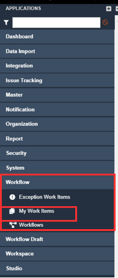
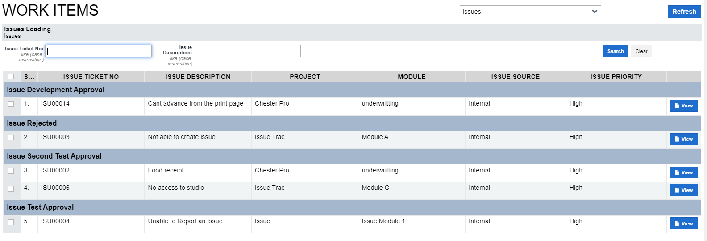

# Workflow
The workflow application allows your organization to automate processes in the system.  A workflow is the sequence of steps a process takes from start to finish. Apart from helping to reduce labor costs, the workflow automation application improves accuracy within a particular workflow.  Human error can be significantly reduced due to the limited number of actions a user can take in implementing a workflow.  
To implement a workflow, you will need to use a trigger event that, once satisfied, causes a particular set of actions to be performed across your applications. Workflow automation can be applied to processes in various organizational departments such as sales, finance, human resources (HR), and information technology (IT). For example, you can create a workflow to streamline the user approval process. When a new user form is submitted for approval, it triggers a user approval workflow. 
    

      
    

  
## Workflow Item
Workflow item is a record of the actions performed in workflows. As a workflow is triggered, the information about where the item is coming from, the next step of action in the workflow process, the date, the user that forwarded the item, its priority on a scale of importance, error codes, and error messages is displayed by the workflow item. 

  

    

      
    

  

## Workflows
## Exception Workflow
