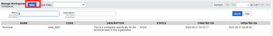
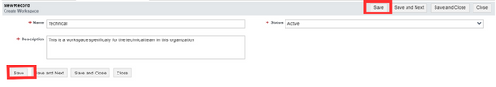
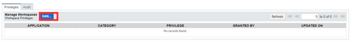
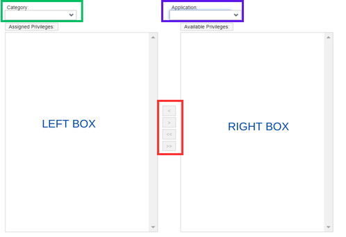

# Workspace
Workspace is an applet where developers and users organize and manage source code files, project resources, and related items. A workspace is designed to provide a consolidated and unified setting for working on a given project or job.

This workspace is on the sidebar which is located on the left hand side of the system
## Create a Workspace

This section highlights the step-by-step process involved in creating a workspace and also describes what each field means.
 

<ol>
    <li><b>Click the New button:</b> 
      This is the first step in creating a new workspace. The New button is located at the top-left part of the page. This button opens a blank form that contains all the basic information needed for the workspace.
       
     </li>
    <li><b>Fill the new workspace form: </b> 
        Once the New button is clicked a new form comes up. This form contains some mandatory fields that cannot be blank and also some other fields that are not mandatory and can be blank because they are optional.
         
        This form contains fields for the collection of the basic information needed for the new workspace, these fields are
        <ul>
            •	<b>Name:</b> This is the field where the name for the new workspace is entered. 
            •	<b>Description:</b> This is an overall description of the workspace. It lets you know what the workspaceis about. 
            •	<b>Status:</b> This allows us to indicate the status of the workspace at a particular time. This status can be            Active,Inactive, or Dormant. 
            •	<b>Action Buttons:</b> The workspace form also include some buttons, all with their individual actions.
                o	Save: This button saves the form after all necessary fields have been filled.
                o	Save and Next: This button saves the form and opens a new form.
                o	Save and Close: This button saves and closes the form after saving.
                o	Close: This button closes the form page once clicked. 
        </ul>
    </li>
    <li><b>Save your form:</b>
        After all fields in the form have been filled, the next step is to save the form. To save this form, click on the Save, Save and Next, or Save and Close (this depends on which saving method you decide to go with) button which is located both at the right-top and at the left-bottom of the form.
       
    </li>
     
</ol>
## Child Tab Update
### PRIVILEGES
In the system, after a workspace is created, Workspace Privileges need to be assigned to give users access to applications, applets, and dashboards. 
To assign privileges to the workspace created:
    <b>1.	Edit Privileges child tab:</b>
    •	Click the Edit button: once clicked this button will direct you to the page where you will assign available privileges to the created workspace
       
  
<b>2.	Assign Privileges: </b>
aAfter clicking the Edit button, a page comes up containing a list of available privileges. This is where you will assign required privileges to the workspace created. 
The box on the right-hand side((labeled RIGHT BOX)) <b>Available privileges</b> contains the privileges available in the system, while the box on the left-hand side(labeled LEFT BOX) labelled <b>Assigned privileges</b> is where the privileges selected will be moved to. 
For the available privileges to come up select a category and application associated to the workspace you created. It is good to note that the options to come up for Application dropdown depends on the option you select in Category. 
       
The arrows in the middle of the two boxes are for moving the roles from the available box to the assigned box and vice versa. The first two arrows are for moving the role one after the other, while the last two arrows move all the roles at once.

> A category must be selected for privileges to come up.